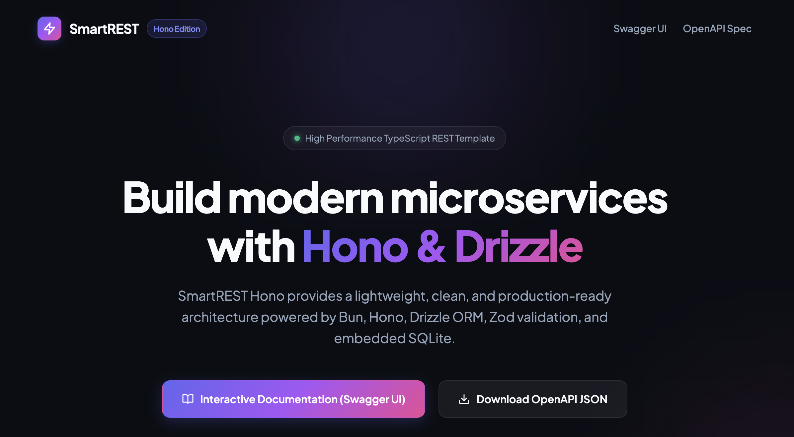

# SmartREST - Hono Edition

SmartREST Hono is a modern, lightweight, and type-safe template for building REST API microservices in TypeScript using Bun and Hono.



[Visit SmartREST Hono on Netlify](https://smartrest-hono.netlify.app/)

## Features

* ⚡ **Bun Runtime & Package Manager**: Ultra-fast execution and native test runner.
* 🔥 **Hono Framework**: High-performance, lightweight web framework.
* 🗄️ **Embedded SQLite & Drizzle ORM**: Zero-config relational database with type-safe schema definitions and foreign key support.
* 🛡️ **Zod Validation**: Runtime input validation and strict schema enforcement.
* 📖 **Swagger UI & OpenAPI 3.0**: Self-documenting API with interactive Swagger UI and downloadable JSON specs.
* 📝 **Pino Structured Logger**: Beautiful formatted logs in development and structured JSON in production with full HTTP request/response tracking.
* 🏛️ **Layered Architecture**: Clean separation of concerns across Model, DAO, DTO, Service, and Controller layers.
* 🧪 **Comprehensive Tests**: Preconfigured unit and integration tests with `bun:test`.

---

## Architecture & Project Structure

```
src/
├── controller/        # HTTP route handlers (Home, Person, Phone, Swagger)
├── dao/               # Database Access Objects & DB connection setup
├── dto/               # Zod validation schemas & DTO mappers
├── model/             # Drizzle ORM schemas & table relations
├── service/           # Business logic, seeding, & constraint validation
├── utils/             # Pino logger, HTTP logging middleware, Date utils
└── index.ts           # Application entrypoint
test/                  # Unit & integration test suites
```

---

## Getting Started

### Prerequisites

* [Bun](https://bun.sh) (v1.1+ recommended)

### Installation

```bash
bun install
```

### Development Server

```bash
bun run dev
```

The application will start on `http://localhost:3000`.

* **Home Page**: `http://localhost:3000/`
* **Swagger UI**: `http://localhost:3000/swagger` (or `/docs`)
* **OpenAPI Specification**: `http://localhost:3000/doc` (or download at `/doc/download`)

### Running Tests

```bash
bun test
```

### Production Build

```bash
bun run build
```

---

## Deployment (Netlify)

This project is pre-configured for zero-friction deployment to **Netlify** using Netlify Functions.

1. Connect your repository to Netlify.
2. Netlify will automatically detect the [`netlify.toml`](file:///Users/alessio/Documents/Codice/TypeScript/smartrest-hono/netlify.toml) file with:
   - **Build Command**: `bun run build`
   - **Functions Directory**: `netlify/functions`
   - **Publish Directory**: `public`
3. In serverless environments, SQLite data is automatically configured to use `/tmp/smartrest.db`.

## API Endpoints

### Documentation & Home
| Method | Endpoint | Description |
|---|---|---|
| `GET` | `/` | Professional landing page with template overview and links |
| `GET` | `/swagger` | Interactive Swagger UI API documentation |
| `GET` | `/doc` | OpenAPI 3.0 JSON specification |
| `GET` | `/doc/download` | Download `openapi.json` attachment |

### Persons API (`/api/persons`)
| Method | Endpoint | Description |
|---|---|---|
| `GET` | `/api/persons` | List all persons with their phone numbers |
| `GET` | `/api/persons/:id` | Get person by ID with phone numbers |
| `POST` | `/api/persons` | Create a person with 1 to 2 phone numbers |
| `PATCH` | `/api/persons/:id` | Update person attributes |
| `DELETE` | `/api/persons/:id` | Delete person (cascades to phones) |
| `POST` | `/api/persons/seed` | Seed database with 10 persons and 15 phones |

### Phones API (`/api/phones`)
| Method | Endpoint | Description |
|---|---|---|
| `GET` | `/api/phones` | List all registered phone numbers |
| `GET` | `/api/phones/search?query=...` | Search phone number and retrieve owner person |
| `GET` | `/api/phones/lookup/:number` | Exact phone lookup with owner person |
| `POST` | `/api/phones` | Add phone to an existing person (max 2 per person) |

---

## License

Licensed under the [ISC License](LICENSE).  
Copyright &copy; 2026 Alessio Saltarin.
